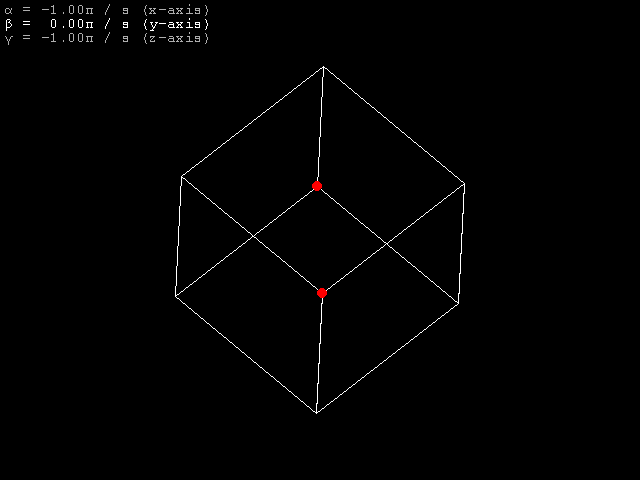

# Laboratory work № 1
## Rotation of 3D around set axes

Cube only rotates when mouse button is pressed. Scrolling mouse wheel changes one of 3 rotation angles. By pressing *x*, *y* or *z* one can select angle to change. 

