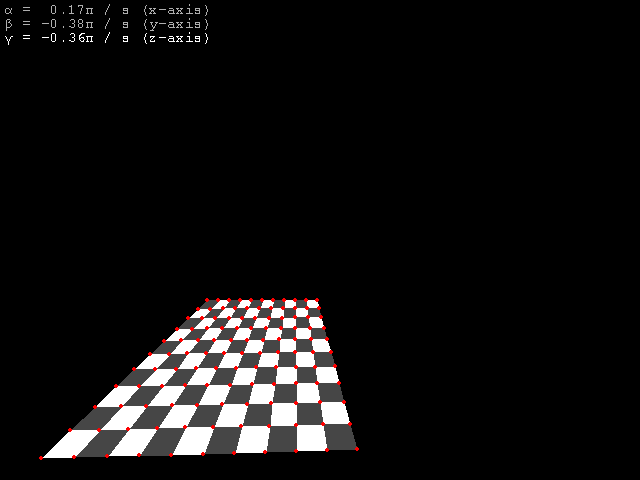

# Laboratory work № 3
## Bilinear planes

This demo shows bilinear planes implementation in plane numpy. Linear grid rotates when mouse button is pressed. Scrolling mouse wheel changes one of 3 rotation angles. By pressing *x*, *y* or *z* one can select angle to change. Pressing *w* toggles wireframe.

