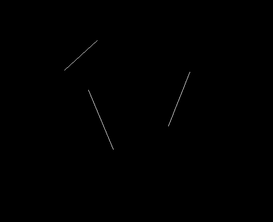

# Laboratory work № 4
## Cohen–Sutherland line clipping algorithm

Hold and drag a mouse to select view border. After selection lines will be clipped to the rectangle. Press ``R`` to generate new lines.

