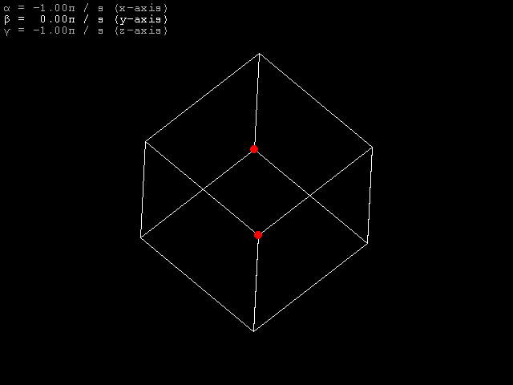
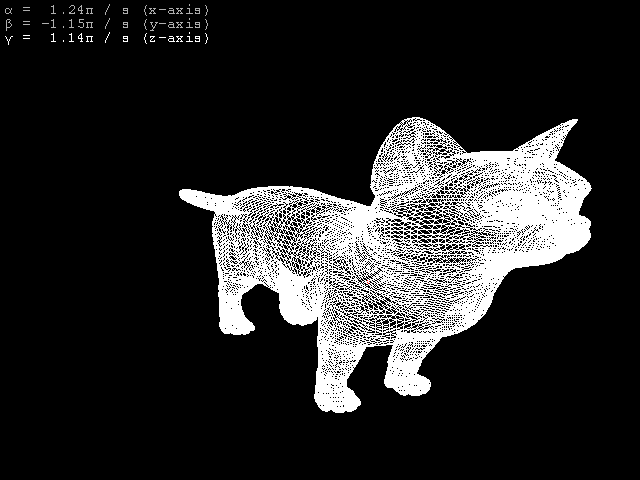

# Laboratory work № 1
## Rotation of 3D object around set axes

Cube only rotates when mouse button is pressed. Scrolling mouse wheel changes one of 3 rotation angles. By pressing *x*, *y* or *z* one can select angle to change. 

### main_old.py
Here basic cube is rotated around global axes and is projected by isometric projection.

### main.py
At this point I rewrote all the code so that everything is formed from polygons. 

